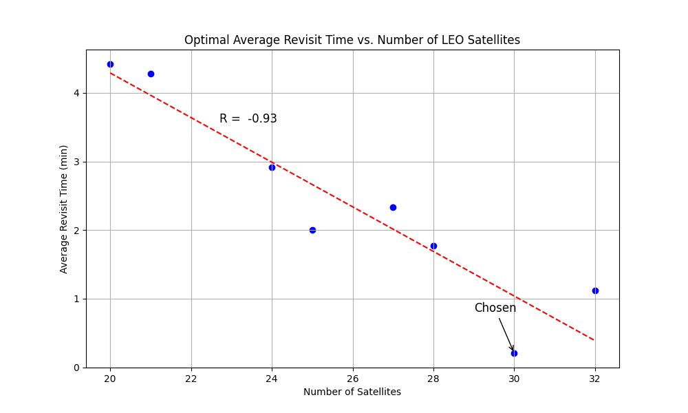
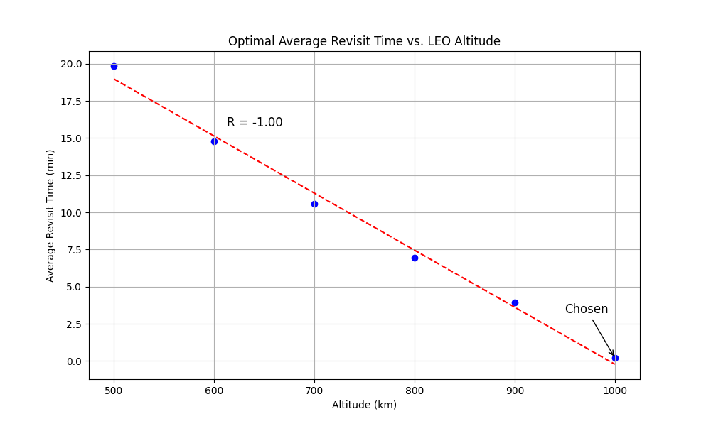
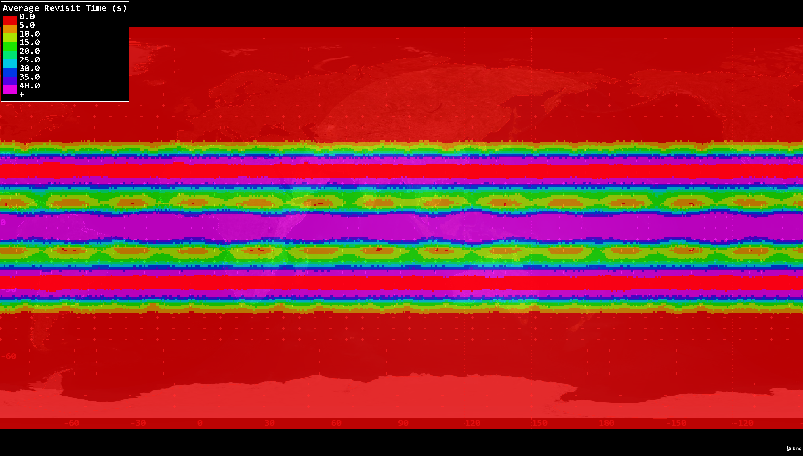
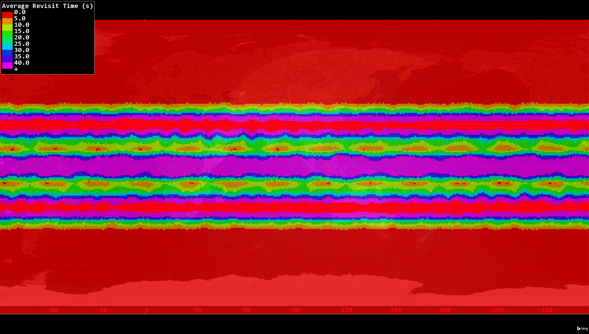

# HYPERION: Constellation Optimization

## Methodology
- Using STK Analyzer plugin and specifically, the Design of Experiments (DOE) Tool
- 3 Phase Strategy
    - Phase 1: Custom parameter sweep for LEO constellation
    - Phase 2: Custom parameter sweep for MEO constellation
    - Phase 3: Refinement and Verification for HYPERION constellation
- Phases 1 and 2 done simultaneously
- Phase 3 assimilates and verifies results
- 3 Phase strategy reduces search space from ~357,000,000 possibilities to ~27,000

## Models and Assumptions
### LEO & MEO Sats
- Circular orbit
- Single shell (multiple planes)
- J2 propagator
- Single day propagation (11/10/24 18:00:00 UTC - 11/11/24 18:00:00 UTC)
- Walker delta configuration (i: t/p/f)
- Cross-plane and in-plane visibility: Line of sight (LOS)
### LEO Sensors
- Single SWIR
- Simple conic 
- High resolution, large half angle
- Pointing along Nadir vector (to center of Earth)
### MEO Sensors
- Single SWIR
- Simple conic
- Low resolution, small half angle
- Pointing along Nadir vector (to center of Earth)
### Ground Coverage Definition
- +/- 90 deg latitude (full coverage)
- 10 deg point granularity
### Ground Stations
- Near Space Network
- Visibility requirement: 5 deg minimum elevation angle
- LEOs route information in-plane to GS (max 3 hops)
- MEOS route information in-plane to GS (max 1 hops)
- Alaska Satellite Facility (ASFS): 64° 51' 31" N, 147° 51' 27" W
- NASA White Sands Facility (WSC): 32° 32' 27" N, 106° 36' 44" W
- NASA Wallops Ground Station (WGS): 37° 55' 28" N, 75° 28' 35" W
### Missiles
- 3 missiles launched at intervals over the analysis window
- Modeled as aircraft with waypoints
- Ground launches only
- Launched from local terrain altitude
- Missile 1:
    - Launch site: Plesetsk Cosmodrome, Russia (62.96 N, 40.683 E)
    - Target site: White House, Washington D.C., U.S. (38.8977 N, 77.0365 W)
    - Time of Launch: 11/10/24 18:00:00 UTC
    - Time of Impact: 11/10/24 19:12:12.700 UTC
    - Speed: Mach 5
    - Altitude: 20 km
- Missile 2: 
    - Launch site: Pacific Ocean (0 N, 160 E)
    - Target site: Military Ocean Terminal Concord, California, U.S. (37.9942 N, 121.983 W)
    - Time of Launch: 11/11/24 06:00:00 UTC
    - Time of Impact: 11/11/24 06:58:06.980 UTC
    - Speed: Mach 7.5
    - Altitude: 50 km
- Missile 3:
    - Launch site: Chaotanbi, China (20.0406 N, 110.765 E)
    - Target site: Naval Weapons Station Seal Beach, California, U.S. (33.75 N, 118.067 W)
    - Time of Launch: 11/11/24 15:00:00 UTC
    - Time of Impact: 11/11/24 15:58:54.010 UTC
    - Speed: Mach 10 
    - Altitude: 80 km

## Phase 1: LEO DOE
- Design variables (start, stop, step):
    - Inclination (80 deg, 90 deg, 2 deg)
    - Number of planes (4, 10, 1)
    - Sats per plane (3, 8, 1)
    - Phasing (2, 9, 1)
    - Altitude (500, 1000, 100)
    - SWIR conic half angle (30, 60, 10)
- Constraints:
    - 20 <= Number of planes * number of sats per plane <= 32
    - 1 < Phasing < Number of planes
- Outputs:
    - Overall maximum revisit time
    - Overall average revisit time
    - Missile 1 response time (time from launch to visibility)
    - Missile 2 response time
    - Missile 3 response time
    - Overall average missile access duration
- Weights for Scoring:
    - Overall maximum revisit time: 0.3
    - Overall average revisit time: 0.3
    - Average missile response time: 0.2
    - Average missile access duration: 0.2
- Search space: 8928 configurations

## Phase 2: MEO DOE
- Design variables (start, stop, step):
    - Inclination (80 deg, 90 deg, 2 deg)
    - Number of planes (4, 10, 1)
    - Sats per plane (3, 8, 1)
    - Phasing (2, 9, 1)
    - Altitude (2000, 10000, 1000)
    - SWIR conic half angle (5, 25, 5)
- Constraints:
    - 20 <= Number of planes * number of sats per plane <= 32
    - 1 < Phasing < Number of planes
- Outputs:
    - Overall average access duration
    - Overall average revisit time
    - Overall maximum revisit time
    - Missile 1 tracking time / Missile 1 flight time (percentage of visibility)
    - Missile 2 tracking time / Missile 2 flight time
    - Missile 3 tracking time / Missile 3 flight time
    - Overall average missile access duration
- Weights for Scoring:
    - Overall average access duration: 0.3
    - Overall average revisit time: 0.2
    - Overall maximum revisit time: 0.2
    - Total missile tracking time / total flight time: 0.2
    - Overall average missile access duration: 0.1
- Search space: 16740 configurations

## Phase 3: HYPERION DOE
- Design table generated by synthesizing LEO and MEO DOE's
- Outputs:
    - Overall average revisit time
    - Overall maximum revisit time
    - Ground station to LEO sats to missiles total access duration 
    - Ground station to MEO sats to missiles total access duration
    - Overall average LEO sat to ground station access
    - Overall average LEO sat to LEO sat access
    - Overall average LEO sat to MEO sat access
    - Overall average MEO sat to ground station access
    - Overall average MEO sat to MEO sat access
- Weights for Scoring:
    - Ground station to LEO sats to missiles total access: 0.1
    - Ground station to MEO sats to missiles total access: 0.1
    - Overall average LEO sat to ground station access: 0.15
    - Overall average LEO sat to LEO sat access: 0.1
    - Overall average LEO sat to MEO sat access: 0.3
    - Overall average MEO sat to ground station access: 0.15
    - Overall average MEO sat to MEO sat access: 0.1
- Search space: 625 configurations (top 25 LEO by top 25 MEO)
- Post-processing Verification:
    - No gaps in continuous LOS between LEO and MEO sats
    - No gaps in continuous LOS between LEO and LEO sats
    - No gaps in continuous LOS between MEO and MEO sats
    - Valid, continuous chains from LEO sats to ground stations
    - Valid, continuous chains from LEO sats to ground stations
    - Average hops from LEO sats to ground stations [0, 3]
    - Average hops from MEO sats to ground stations [0, 1]

## Expected/Preliminary Results
- LEO completed trial count: 2142
- MEO completed trial count: 1362
- HYPERION completed trial count: 1 (top LEO by top MEO)

### Design Variables
| **Variable**             | **LEO Shell 1** | **LEO Shell 2** | **MEO**     |
|---------------------------|-----------------|-----------------|-------------|
| Inclination (i)     | 82.0°           | 10.0°           | 90.0°       |
| Total number of sats (t) | 30              | 2               | 21          |
| Planes (p)           | 5               | 1               | 7           |
| Phasing factor (f)   | 3               | 0               | 3           |
| Altitude (h)         | 1000 km         | 1000 km         | 10000 km    |
| Sensor conic half angle (η) | 60°         | 60°            | 25°         |

*Second LEO shell added to aid with poor equatorial coverage

### Performance

| | **LEO Performance** | |
|---------------------------------------|---------------------------|---------|
| | **One Shell** | **Two Shells** |
| Average revisit (min)                 |  3.2087e-1 | 3.1517e-1 |
| Maximum revisit (min)                 | 1.6496 | 1.6463 |
| Average missile response time (s)     | 1.1427 | 4.6667e-3 |
| Average missile access duration (min) | 7.7945 | 6.898 |

| **MEO Performance**                     |                           |
|-----------------------------------------|---------------------------|
| Average revisit (min)                   | 0.0                       |
| Maximum revisit (min)                   | 0.0                       |
| Average access duration (min)           | 105.30                    |
| % Missile visibility                    | 100                       |
| Average missile access duration (min)   | 47.499                    |

| **HYPERION Performance**                           |                           |
|----------------------------------------------------|---------------------------|
| Gaps in LOS between LEO and MEO (boolean)          | False                     |
| Gaps in LOS between LEO and LEO (boolean)        | False |
| Gaps in LOS between MEO and MEO (boolean)         | False |
| Average total gap time in valid chain between LEO and GS (min) | 0.0 |
| Average total gap time in valid chain between MEO and GS (min) | 0.0 |
| Average number of hops from LEO to ground stations | 2.7610 |
| Average number of hops from MEO to ground stations | 0.9424 |
| Average number of hops from missiles to LEO to ground stations | 1.8274 | FIX
| Average number of hops from missiles to MEO to ground stations | 0.9041 |

### Figures

#### LEO

    
    

    

        
        
Average LEO revisit time heat map (single shell)

    

    

        
        
Average LEO revisit time heat map (two shells)

    

    

#### MEO

    
    

#### HYPERION

    
    
2D representation of HYPERION

    
    
3D representation of HYPERION

    
    
Instantaneous ground station communication access

    
    
Instantaneous satellite communication access

| **Possible Figures/Animations** |
| ----------------------- |
| Avg revisit vs altitude | 
| Avg revisit vs number of sats |
| Avg missile response vs number of LEO sats |
| Avg missile visibility % vs number of MEO sats |
| Revisit time vs latitude and longitude (heat map) |
| Full scenario animation |
| Missile launch with lines of visibility from sensors to missile, sats to sats, and sats to ground stations |
| Lines of visibility between LEO and MEO, LEO and LEO, MEO and MEO |

## Traceability to Requirements
### System
1. The system shall be capable of detecting hypersonic missile launches within a time frame that allows for effective countermeasure deployment. (Threshold: 30 sec, Objective: 1 sec)
    - Verified by LEO avg missile response
2. The system shall be configured to provide consistent global revisit times supporting timely detection of launches across all latitudes. (Threshold: 10 min, Objective: 1 sec)
    - Verified by revisit time graphs for LEO and MEO
3. LEO satellites shall orbit between altitudes of 500-1000 km.
    - Verified by chosen LEO altitude
4. The LEO constellation shall consist of no more than 32 satellites.
    - Verified by chosen number of LEO sats
5. HYPERION shall be capable of tracking hypersonic missiles throughout their flight path.
    - Verified by MEO avg missile visibility / flight time
6. MEO satellites shall orbit between 2000-10000 km.
    - Verified by chosen MEO altitude
7. HYPERION shall be arranged to provide near-global coverage, ensuring comprehensive observation of all latitudes over a complete orbital period.
    - Verified by revisit time heat map and chosen inclination
8. Satellites shall be capable of in-plane communication
    - Verified by continuous LOS analysis
9. The satellites shall be capable of cross-plane communication.
    - Verified by continuous LOS analysis

### Orbits
1. The MEO constellation shall be designed with sufficient satellite density and plane configuration to maintain continuous coverage
    - Verified by zero average revisit time for MEO constellation
2. The MEO satellites shall be positioned to balance wide-area coverage and low communication latency with the LEO constellation.
    - Verified by zero average revisit time + some average distance to LEO sats?
3. The LEO constellation shall have a local time of ascending node (LTAN) staggered to ensure uniform temporal distribution of satellite passes over critical areas.
    - Verified by non-unity phasing factor (f)
4. The orbital configuration shall ensure that each LEO satellite maintains continuous line-of-sight (LOS) communication with at least one MEO satellite.
    - Verified by continuous LOS analysis

## Next Steps
- More missiles and more accurate missile modeling
- Aircraft missile launches
- Non-zero eccentricity to focus more on high priority regions
- More sensors
- Longer propagation window
- Improve coverage definition granularity